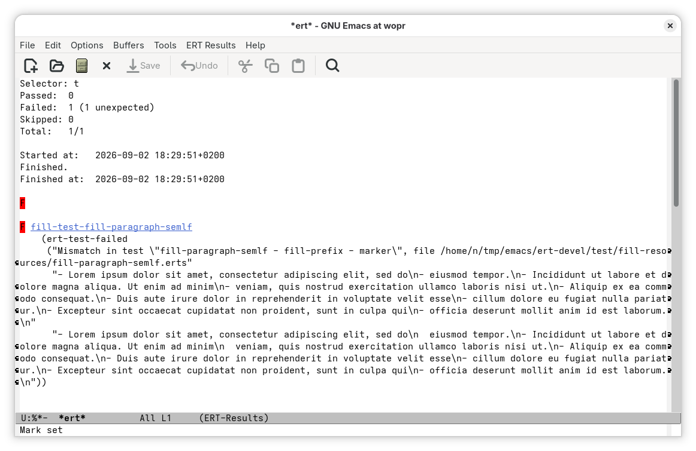
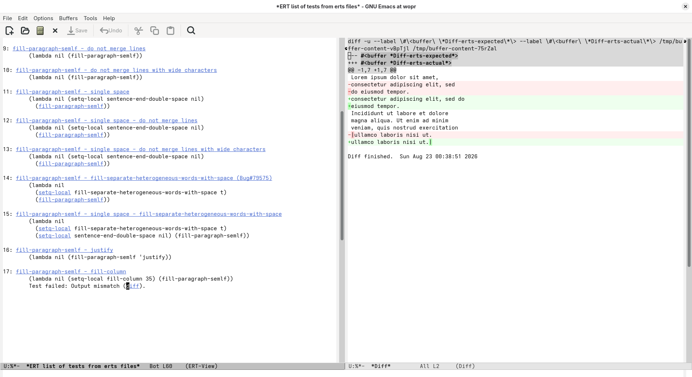

#+title: ERT Erts-file Test Results
#+author: Roi Martin
#+date: <2026-09-02 Wed>
#+options: num:nil toc:nil
#+html_link_up: /

While I was working on the [[file:semlf.org][semantic linefeeds]] feature in GNU Emacs, I
had to write quite a lot of tests: first, to avoid breaking core GNU
Emacs functionality, which is "text filling" and, second, to cover as
many edge cases as possible in this new feature.
Most of these tests consist of taking a buffer with text, applying a
filling function to it and comparing the resulting buffer with the
expected one.

For this kind of tests, ERT (Emacs Lisp Regression Testing) provides a
very useful feature called erts files (see the Info node =(ert) erts
files=).

In short, an erts file consists of a list of entries like the
following:

#+begin_src erts
Name: fill-paragraph-semlf - fill-column
Code:
  (lambda ()
    (setq-local fill-column 35)
    (fill-paragraph-semlf))

=-=
Lorem ipsum dolor sit amet, consectetur adipiscing elit, sed do
eiusmod tempor.  Incididunt ut labore et dolore magna aliqua. Ut enim
ad minim veniam, quis nostrud exercitation ullamco laboris nisi ut.
=-=
Lorem ipsum dolor sit amet,
consectetur adipiscing elit, sed do
eiusmod tempor.
Incididunt ut labore et dolore
magna aliqua. Ut enim ad minim
veniam, quis nostrud exercitation
ullamco laboris nisi ut.
=-=-=
#+end_src

Then, you can reference it from a test with the ~ert-test-erts-file~
function:

#+begin_src emacs-lisp
(ert-deftest fill-test-fill-paragraph-semlf ()
  "Test the `fill-paragraph-semlf' function."
  (ert-test-erts-file (ert-resource-file "fill-paragraph-semlf.erts")))
#+end_src

The problem is that ERT does not report erts errors in a very friendly
manner:

So, I created a new erts-file test view that can be opened from the
main ERT results buffer by pressing =e= on a test:

For tests that call ~ert-test-erts-file~, this view contains a list of
the tests defined in the referenced erts files that have been
executed.
Tests that were skipped are omitted and, if a test fails, the list
ends with the failing test.

Each entry consists of the name of the test followed by the code that
performs the transform being tested.
The buffer also contains buttons that allow jumping to the test
definitions.
Additionally, if a test fails, the diff button displays a Diff Mode
buffer comparing the actual and expected output.

In my experience, this new feature makes working with big number of
erts files and test cases way easier.
From navigating test cases to identifying and fixing the failing ones.
