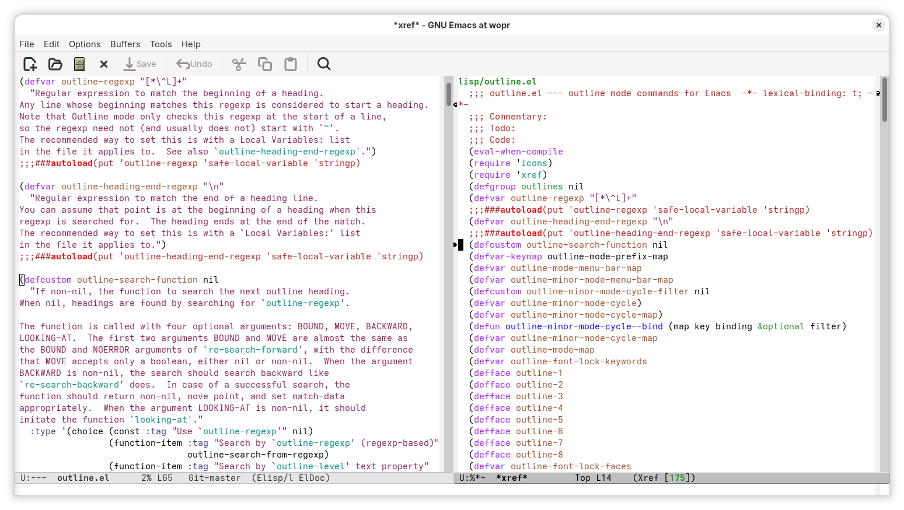

#+title: Outline-find-headings
#+author: Roi Martin
#+date: <2026-09-08 Tue>
#+options: num:nil toc:nil
#+html_link_up: /

Outline-find-headings---initially named outline-occur and later
outline-xref---is a GNU Emacs feature that allows you to navigate the
current buffer's outline using Xref.
Outline-find-headings uses two pieces of the built-in GNU Emacs
infrastructure to provide this functionality: Outline and Xref.

Outline is specialized in editing outlines, which are defined by
"headings".
For instance, headlines in an Org document, function and variable
declarations in source code, etc.
Outline integrates with several major modes that customize what are
headings and how they can be found in a buffer.

Xref provides generic infrastructure for cross-referencing commands.
It can be used to present a variety of results like search matches,
references to identifiers, etc.

The idea behind outline-find-headings is to leverage Outline to
identify the headings in a given buffer and use Xref to display them.
That provides a nice quick overview of the working document and makes
it easy to jump around the relevant sections.

* Usage

There is a single entry point, which is the ~outline-find-headings~
command.
I bind it to =M-s M-o= for easy access from any buffer (assuming the
default =M-s= binding for ~search-map~):

#+begin_src emacs-lisp
(keymap-set search-map "M-o" #'outline-find-headings)
#+end_src

When you execute this command, it will display an Xref buffer with the
outline of the current buffer.
The following screenshot shows it in action:

In general, it just works and you don't have to configure anything.
This is because major modes usually take care of setting the relevant
outline variables.
However, if you have specific needs, you can customize the
~outline-search-function~ and ~outline-regexp~ variables.
Remember to read their corresponding doc strings for more information.

* History

** 2026-07-15

Outline-find-headings starts as a tiny package named outline-occur.
It is still available in the following read-only source code
repository:

- [[https://github.com/jroimartin/outline-occur]]

** 2026-08-04

After announcing the outline-occur package in the emacs-devel mailing
list, we decided that it made sense to integrate it into GNU Emacs
core.

If you would like to dig deeper, see the following commits:

- [[https://cgit.git.savannah.gnu.org/cgit/emacs.git/commit/?id=8a88f3ed5aeece4a7c8edbebc83ed52479fbbfab][8a88f3ed5aee]] "Add `outline-occur' command and `display-buffer-default-alist' variable"
- [[https://cgit.git.savannah.gnu.org/cgit/emacs.git/commit/?id=9e6f03993b824b69d7946b0e23850383d8cd3a72][9e6f03993b82]] "* lisp/outline.el (outline-occur): Autoload."

** 2026-08-11

Outline-occur is reimplemented using Xref and renamed to outline-xref.
The reason is that Occur is designed around regular expressions, while
Outline supports both regular expressions and custom search functions
to find outline headings.
In order to provide a navigable outline that matches the headings
identified by Outline, both search strategies must be supported and
Xref is better suited for this task.

If you are curious about the details, see the following commit:

- [[https://cgit.git.savannah.gnu.org/cgit/emacs.git/commit/?id=fcee0b4ff1d8f1039871d46932a0b1bb72b5687f][fcee0b4ff1d8]] "Reimplement `outline-occur' using Xref and match Outline headings"

** 2026-09-08

Outline-xref is renamed to outline-find-headings.
The new name avoids exposing the command's implementation details and
makes it less confusing for users who associate Xref strictly with
cross-references, as outline-find-headings uses Xref as a user
interface.

See the following commit for more information:

- [[https://cgit.git.savannah.gnu.org/cgit/emacs.git/commit/?id=e33b54d938668dfc1889127d7452524c92cbcd5d][e33b54d93866]] "Rename `outline-xref' command to `outline-find-headings'"
